# Lab Mobile Security — Analyse statique APK avec BeVigil et Yaazhini

## Objectif du laboratoire

Ce laboratoire a pour objectif de réaliser une analyse statique défensive d’une application Android pédagogique afin d’identifier des indices d’exposition et des vulnérabilités potentielles à l’aide des outils BeVigil et Yaazhini.

L’ensemble des résultats est ensuite normalisé, trié, corrélé avec OWASP MASVS puis documenté dans un rapport final.

---

# Workflow général du laboratoire

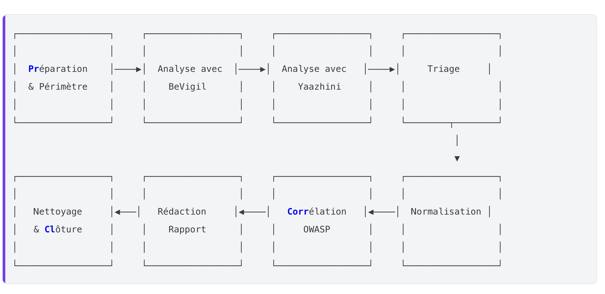

Cette capture présente le workflow complet du laboratoire :

1. Préparation et définition du périmètre
2. Analyse avec BeVigil
3. Analyse avec Yaazhini
4. Triage des constats
5. Normalisation des résultats
6. Corrélation OWASP MASVS
7. Rédaction du rapport
8. Nettoyage et clôture

---

# 1. Définition du périmètre d’analyse

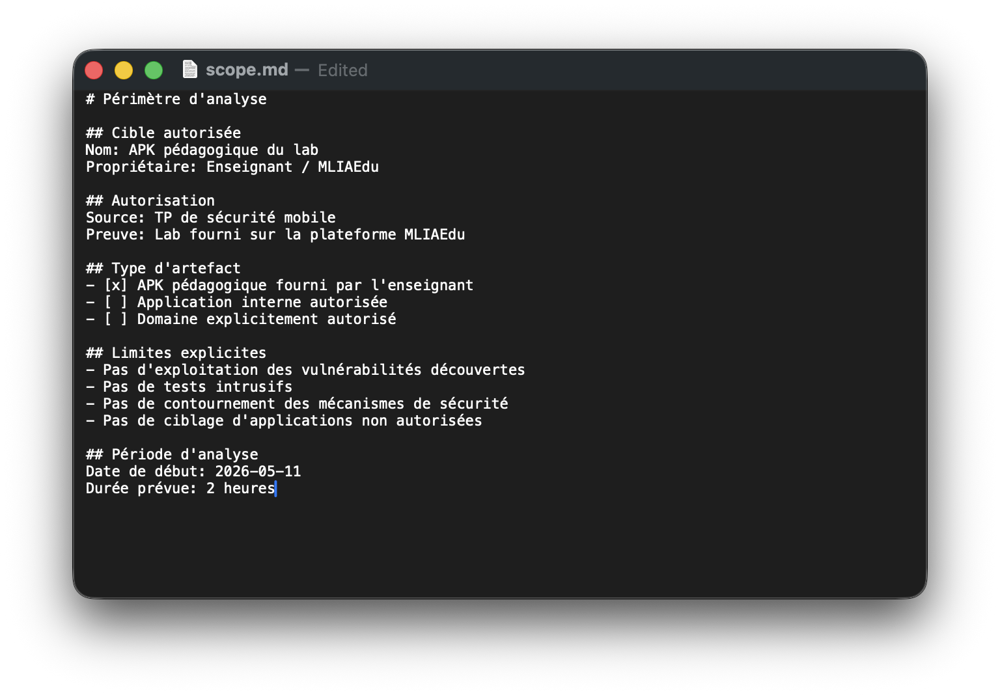

Cette étape consiste à définir clairement :

* la cible autorisée ;
* les limites du laboratoire ;
* les règles éthiques ;
* la période d’analyse ;
* le type d’artefact analysé.

Le fichier `scope.md` garantit que le laboratoire reste dans un cadre strictement pédagogique et défensif.

---

# 2. Création de l’environnement de travail

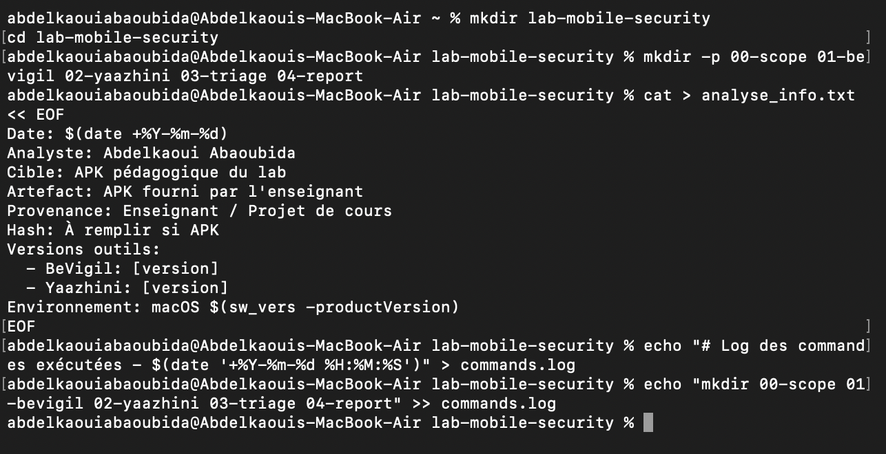

Cette capture montre la création de la structure du projet `lab-mobile-security`.

Les dossiers suivants sont créés :

```text
lab-mobile-security/
├── 00-scope/
├── 01-bevigil/
├── 02-yaazhini/
├── 03-triage/
└── 04-report/
```

Cette organisation facilite le stockage des livrables et la traçabilité du laboratoire.

---

# 3. Initialisation du fichier analyse_info.txt

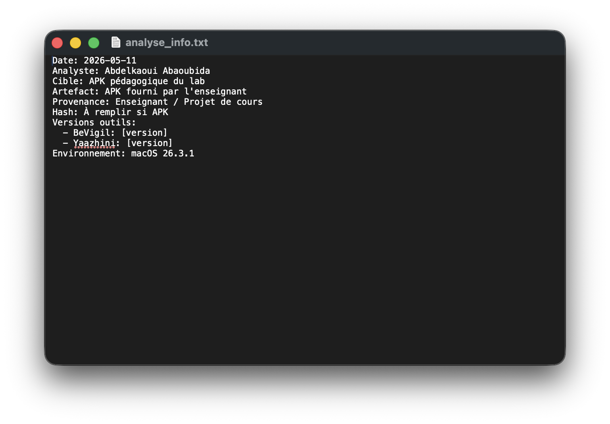

Le fichier `analyse_info.txt` contient :

* la date ;
* le nom de l’analyste ;
* la cible analysée ;
* l’environnement système ;
* les versions des outils ;
* le hash de l’APK.

Cette étape permet de documenter le contexte du laboratoire.

---

# 4. Vérification du contenu initial du fichier d’analyse

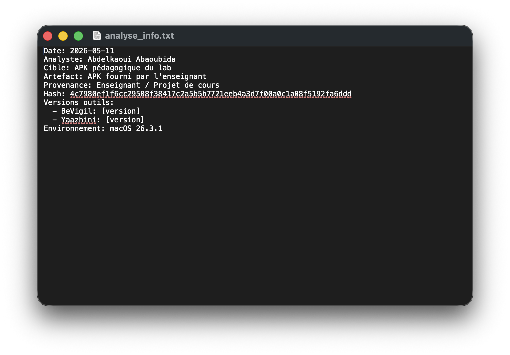

Cette capture confirme que le fichier `analyse_info.txt` a bien été créé avec les informations initiales du laboratoire.

À cette étape, le hash SHA-256 n’est pas encore renseigné.

---

# 5. Ajout du hash SHA-256 de l’APK

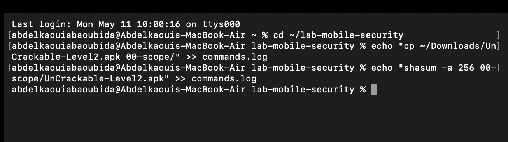

Cette capture montre l’ajout du hash SHA-256 de l’application Android pédagogique.

Le hash permet :

* d’identifier précisément l’APK ;
* de vérifier l’intégrité du fichier ;
* d’assurer la reproductibilité du laboratoire.

Hash documenté :

```text
4c7980ef1f6cc29508f38417c2a5b5b7721eeb4a3d7f00a0c1a08f5192fa6ddd
```

---

# 6. Journalisation des commandes importantes

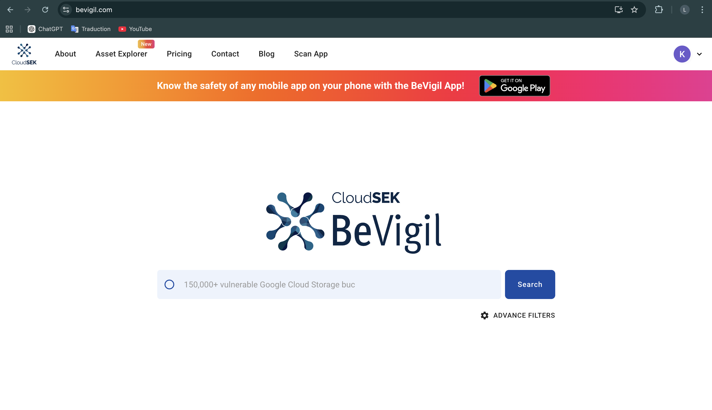

Cette capture montre l’ajout des commandes importantes dans `commands.log`.

Le fichier permet :

* la traçabilité ;
* la reproductibilité ;
* la documentation des étapes techniques.

---

# 7. Accès à la plateforme BeVigil

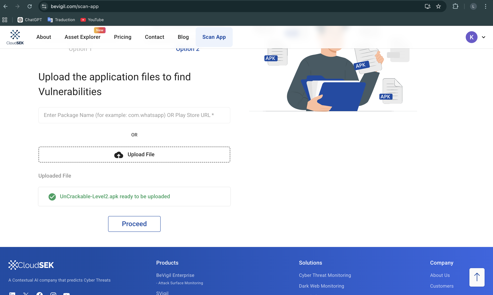

Cette capture montre la page d’accueil de BeVigil.

BeVigil est utilisé pour analyser la posture de sécurité externe de l’application Android.

---

# 8. Upload de l’APK dans BeVigil

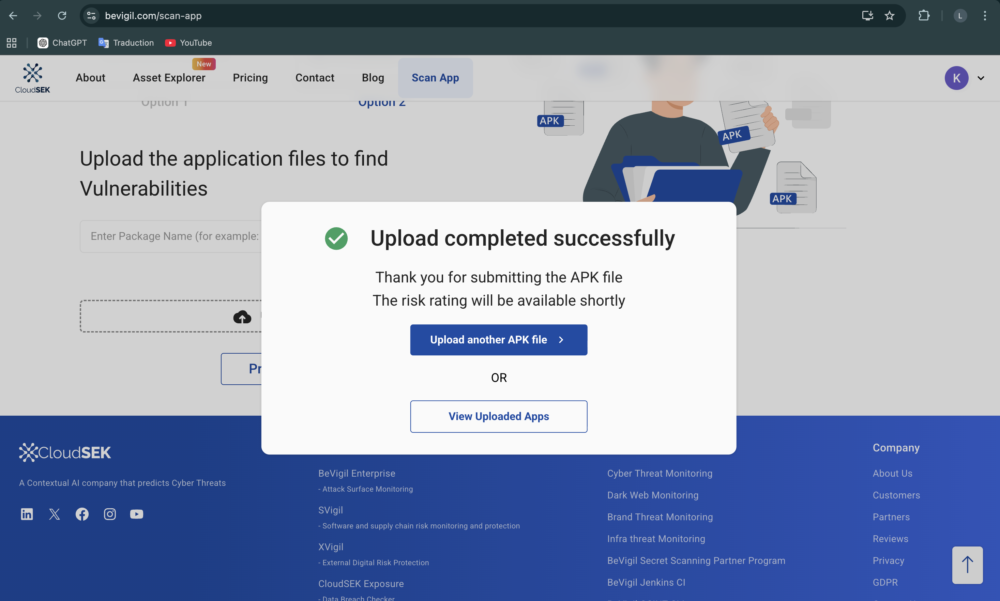

Cette étape montre le chargement de l’APK `UnCrackable-Level2.apk` dans BeVigil afin de lancer l’analyse statique.

---

# 9. Confirmation de l’upload dans BeVigil

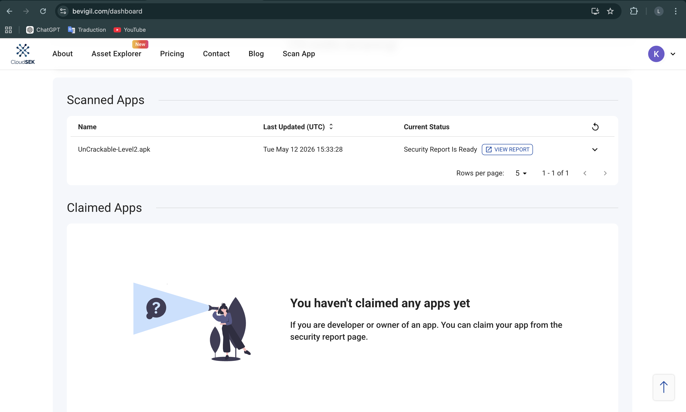

Cette capture confirme que l’APK a été correctement envoyé sur la plateforme.

Le système indique que le rapport de sécurité sera généré automatiquement.

---

# 10. Tableau de bord BeVigil

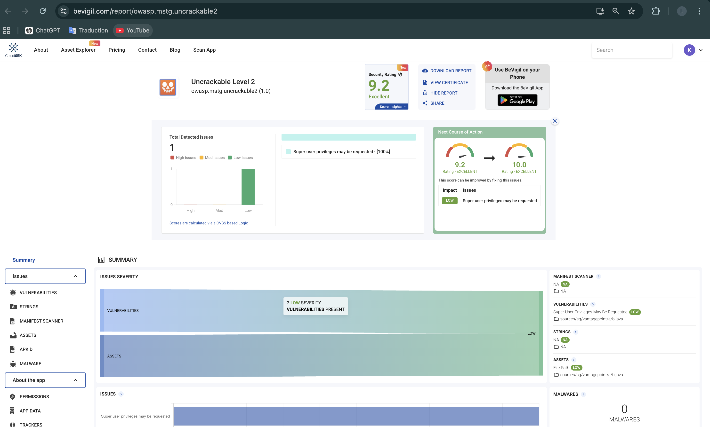

Cette capture montre le tableau de bord des applications analysées.

L’application `UnCrackable-Level2.apk` apparaît avec le statut :

```text
Security Report Is Ready
```

---

# 11. Rapport BeVigil — Résumé général

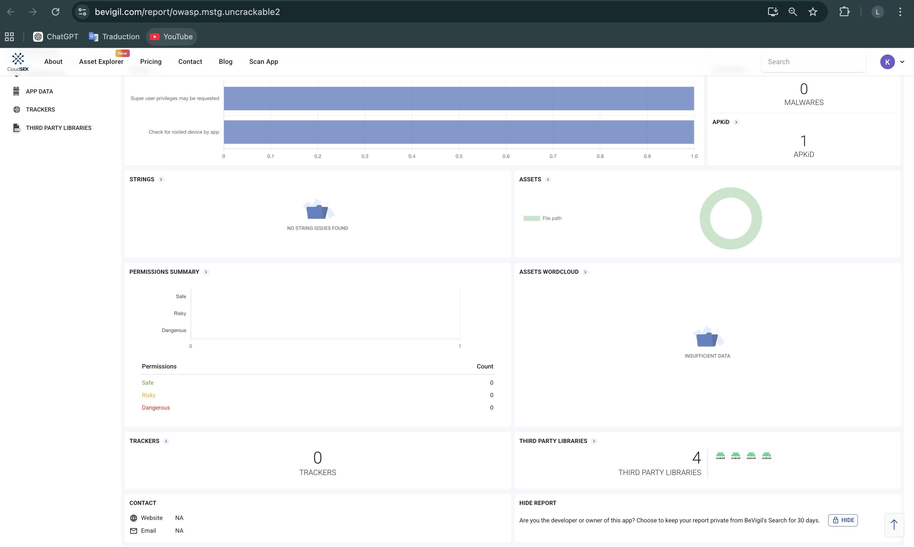

Cette capture présente le résumé principal du rapport BeVigil.

Informations observées :

* Score de sécurité : 9.2
* Vulnérabilités faibles détectées
* Analyse root détectée
* Aucun malware détecté

---

# 12. Rapport BeVigil — Informations détaillées

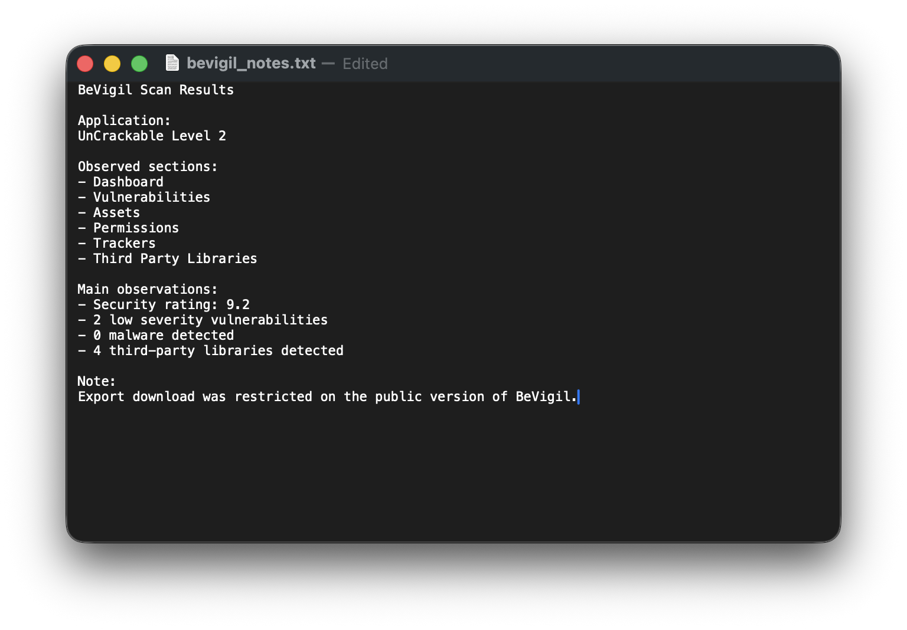

Cette capture montre plusieurs sections détaillées :

* permissions ;
* trackers ;
* assets ;
* bibliothèques tierces ;
* malware ;
* données de contact.

Résultats observés :

* 0 tracker
* 0 malware
* 4 bibliothèques tierces

---

# 13. Création des notes BeVigil

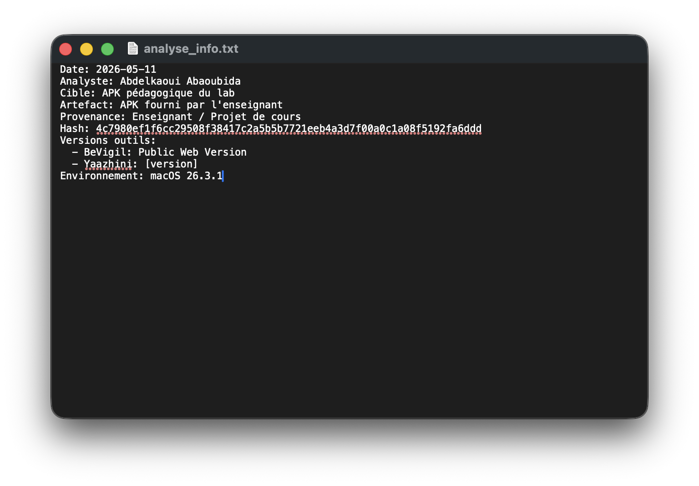

Cette capture montre la création du fichier :

```text
01-bevigil/bevigil_notes.md
```

Le fichier documente :

* les observations ;
* les hypothèses ;
* les limites de l’analyse ;
* les remarques importantes.

---

# 14. Mise à jour des versions des outils

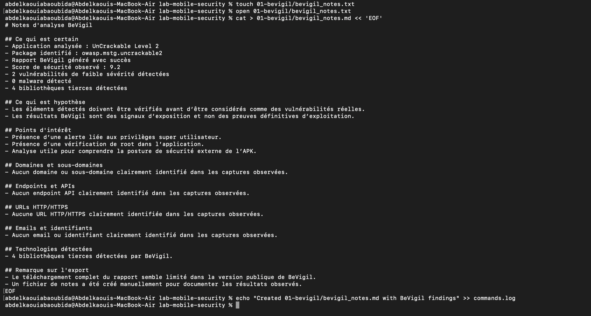

Cette capture montre la mise à jour du fichier `analyse_info.txt` avec la version de BeVigil utilisée.

---

# 15. Préparation du scan Yaazhini

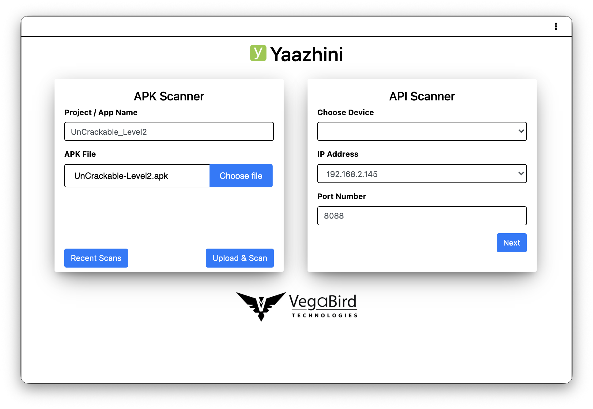

Cette capture montre l’interface Yaazhini avant le lancement du scan APK.

Les informations renseignées :

* nom du projet ;
* APK sélectionnée ;
* paramètres du scanner.

---

# 16. Résumé de l’analyse Yaazhini

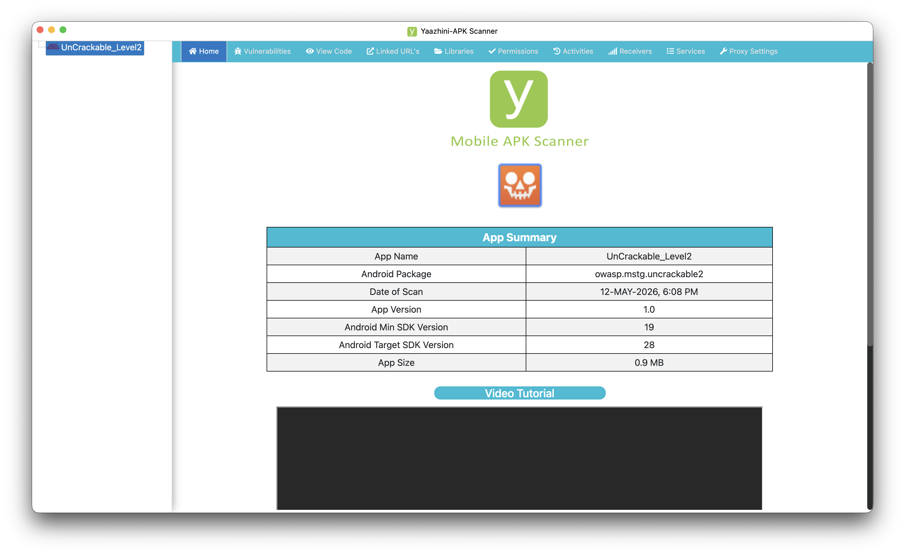

Cette capture présente le résumé principal de l’application analysée dans Yaazhini.

Informations visibles :

* package Android ;
* version de l’application ;
* SDK minimum ;
* SDK cible ;
* taille de l’application.

---

# 17. Mise à jour de la version Yaazhini

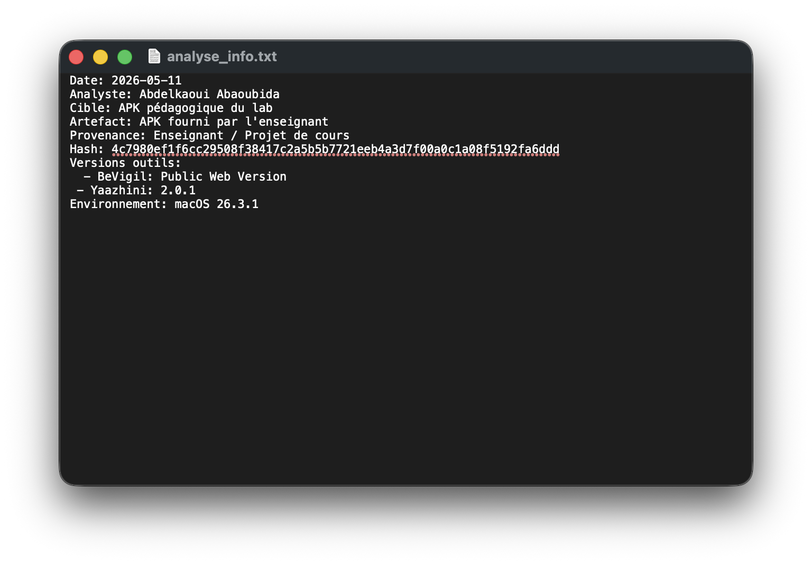

Cette capture montre l’ajout de la version Yaazhini `2.0.1` dans le fichier `analyse_info.txt`.

---

# 18. Rédaction des notes Yaazhini

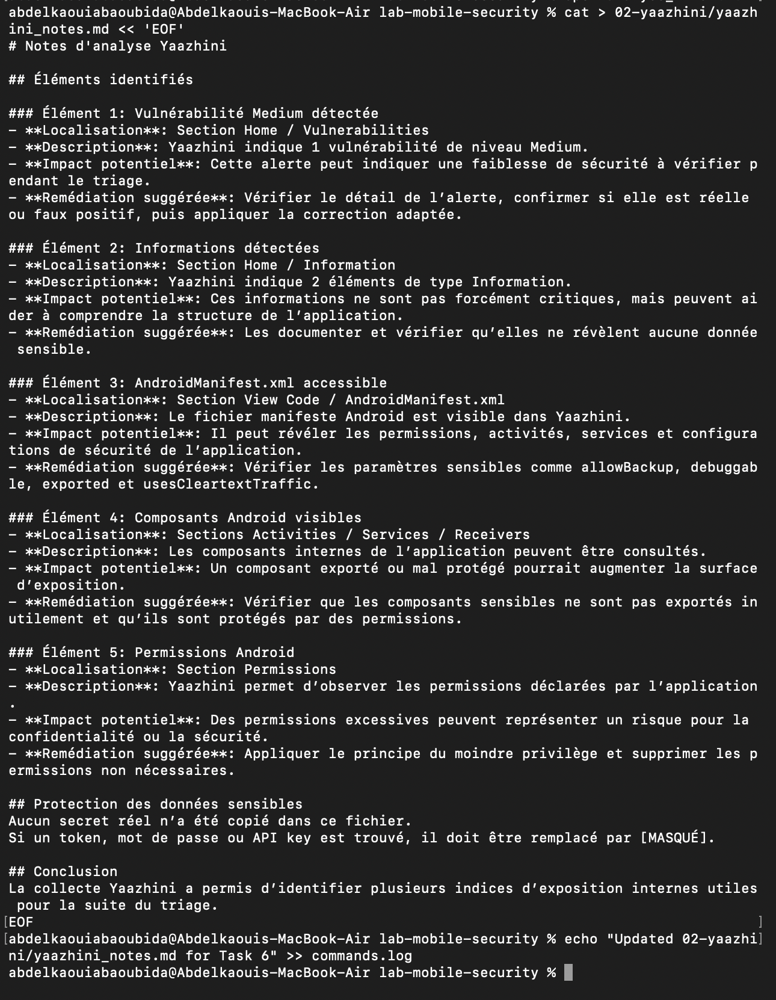

Cette capture montre la création du fichier :

```text
02-yaazhini/yaazhini_notes.md
```

Le document contient :

* vulnérabilités détectées ;
* permissions Android ;
* composants visibles ;
* analyse du manifeste ;
* recommandations.

---

# 19. Création du fichier de triage

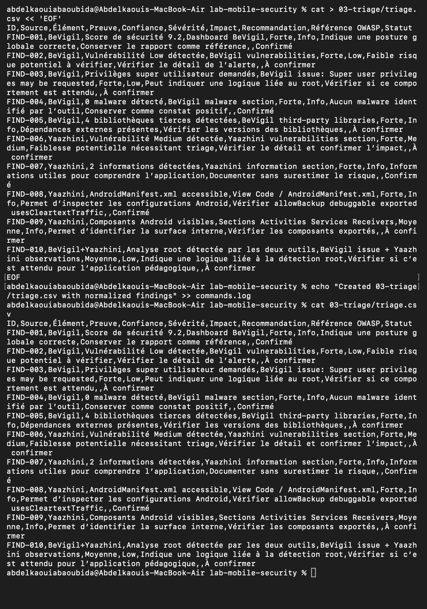

Cette capture montre la création du fichier :

```text
03-triage/triage.csv
```

Le triage centralise tous les constats issus de BeVigil et Yaazhini.

Colonnes utilisées :

* ID ;
* Source ;
* Élément ;
* Preuve ;
* Sévérité ;
* Impact ;
* Recommandation ;
* Référence OWASP ;
* Statut.

---

# 20. Corrélation OWASP MASVS

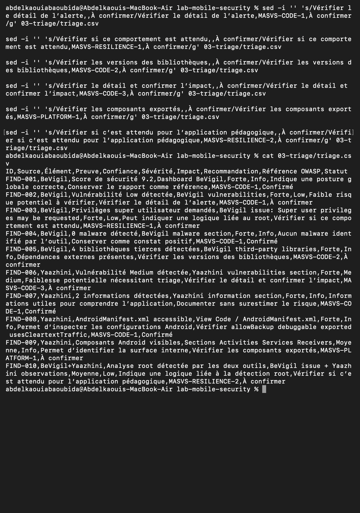

Cette capture montre l’ajout des références OWASP MASVS dans `triage.csv`.

Exemples :

```text
MASVS-CODE-1
MASVS-CODE-2
MASVS-CODE-3
MASVS-PLATFORM-1
MASVS-RESILIENCE-1
MASVS-RESILIENCE-2
```

Cette étape permet de relier les constats aux standards de sécurité mobile OWASP.

---

# 21. Rapport final d’analyse

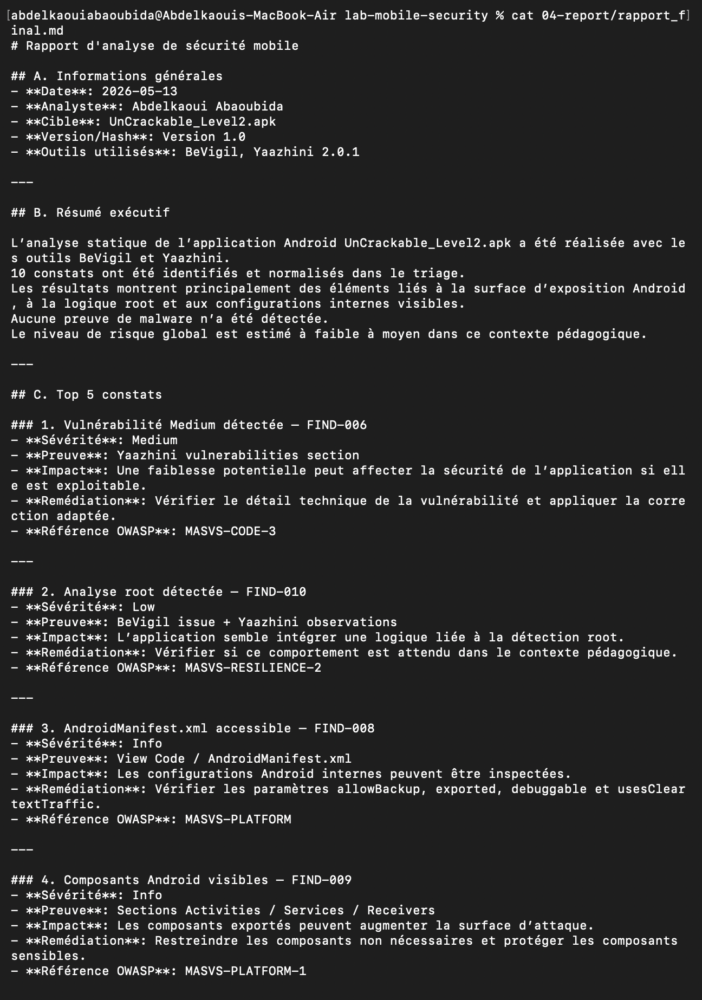

Cette capture montre le fichier :

```text
04-report/rapport_final.md
```

Le rapport contient :

* informations générales ;
* résumé exécutif ;
* top constats ;
* impacts ;
* recommandations ;
* références OWASP.

---

# 22. Checklist finale et clôture

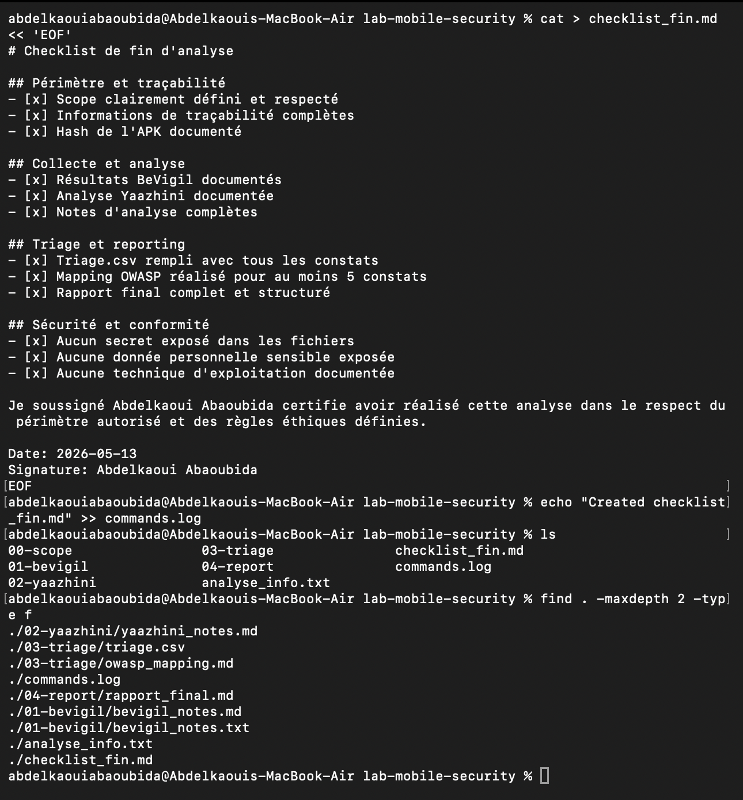

Cette capture montre la création de `checklist_fin.md` ainsi que la vérification finale des livrables.

Les points validés :

* périmètre respecté ;
* traçabilité complète ;
* résultats documentés ;
* mapping OWASP réalisé ;
* absence de données sensibles ;
* rapport final structuré.

---

# Résultats principaux

| Outil    | Résultat                          |
| -------- | --------------------------------- |
| BeVigil  | Score de sécurité 9.2             |
| BeVigil  | 0 malware détecté                 |
| BeVigil  | 4 bibliothèques tierces détectées |
| Yaazhini | 1 vulnérabilité Medium            |
| Yaazhini | 2 informations détectées          |
| Triage   | 10 constats normalisés            |
| OWASP    | Mapping MASVS effectué            |

---

# Structure finale du projet

```text
lab-mobile-security/
├── 00-scope/
│   └── scope.md
├── 01-bevigil/
│   ├── bevigil_notes.md
│   └── bevigil_notes.txt
├── 02-yaazhini/
│   └── yaazhini_notes.md
├── 03-triage/
│   ├── triage.csv
│   └── owasp_mapping.md
├── 04-report/
│   └── rapport_final.md
├── images/
│   ├── 1.png
│   ├── 2.png
│   ├── ...
│   └── 23.png
├── analyse_info.txt
├── commands.log
└── checklist_fin.md
```

---

# Outils utilisés

* BeVigil
* Yaazhini 2.0.1
* macOS Terminal
* Markdown
* SHA-256
* OWASP MASVS

---

# Conclusion

Ce laboratoire a permis de réaliser une analyse statique complète d’une APK pédagogique Android. Les résultats ont été collectés avec BeVigil et Yaazhini, puis normalisés dans un fichier de triage avant d’être corrélés avec OWASP MASVS.

Le travail réalisé permet de comprendre la surface d’exposition de l’application et de produire une documentation structurée respectant un cadre strictement défensif et pédagogique.

---

# Auteur

**Abdelkaoui Abaoubida**
